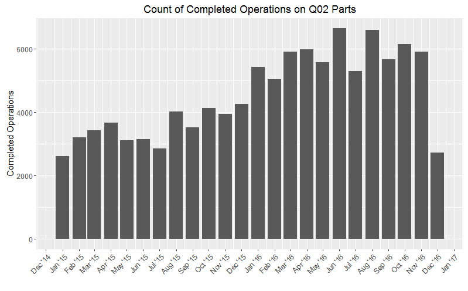
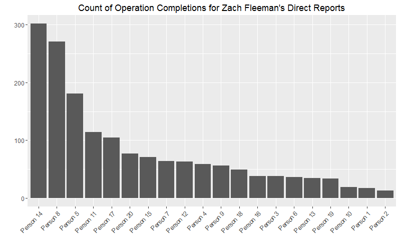

## Background

Productivity in our factory has been a difficult metric to measure given the diverse nature of our product, processes and layout. There have been traditional means of measuring productivity of an hourly worker established in previous years. The most established method is to observe how a worker is charging their time. Every job or work order has an estimated time for completion. If the worker completes this job below the estimated hours, that worker achieves an efficiency above 100%. If the worker charges their time towards direct work throughout the day, and less on meetings or idle time, they are more utilized. I have represented these equations below:

These measures are hesitantly with plant supervision due to the belief that these numbers do not accurately reflect work being completed on the shop floor. Either the 'expected hours' for jobs are inaccurate, resulting in poor efficiencies, or the hours charged are not categorized correctly, resulting in poor utilization.

Less than a year ago, I took a supervisor position in our Quality division. The department I supervise, known as "Receiving Inspection (Q02)," inspects the quality of smaller, *purchased* piece-parts that get built into larger assemblies. My department houses over sixty hourly workers. The main function of our department can be diagrammed as such:

Given the incredible variety of product we inspect, the expected completion times of several of these inspection jobs are wildly inaccurate, leading to an inaccurate 'efficiency' measure, which then leads to an inaccurate reading of our plant's traditional productivity metric.

\newpage

## Proposal

In the past few months, we have been using simple measures of input and output to gain better insights about our department's throughput, or the amount of material that passes through our process. Given that we are the middle man for the part acquisition process in our plant, it is crucial that we inspect and sell quality parts to the factory as quickly as possible. Our workload has doubled in the year that I have been working in the department, and finding a way to bring our throughput measure to the individual will be crucial in understanding the opportunities for improving the productivity of key personnel. I believe we can do this by creating a measure of throughput for each individual worker in our department.

Our job tracking system, *Solumina*, populates a data table in our Oracle database every time a worker completes a step or operation in the job assigned to them. The table is structured like this:

There are multiple ways for a person to pull, aggregate, and display this information. My current belief is that we can gauge the productivity of an hourly worker by aggregating the information in this table. I suspect that if we can show that our more productive workers complete more operations in Solumina, we can create an individual measure of productivity to show less-productive individuals their opportunities for improvement.

I want to generate two visualizations as the result of this data analysis exercise:

1. A chart showing that Receiving Inspection has completed more operations as a department due to our increased workload over two years. Two years of transactions out of Solumina will produce a massive dataset that will need to be effectively manipulated to get any insights.
2. A rolling 30-day look at each of my employees' operation completions. This will give me a measure to recognize those individuals with high throughput and performance manage those with low numbers.

There are a few obvious joins that I will need to make to flesh-out the Solumina dataset. I will need to acquire two extra tables of information:

* Employee information keyed off of their user number. This will pull their supervisors.
* Item/Part number attributes to identify Receiving Inspection (Q02) part numbers/jobs.

\newpage

## Data Work

### 1. Query & Join 

One of the major hurdles analyst-types face at FM&T is the poor access to information. In order to query the transaction table from Solumina, we need to use our ERP software, PeopleSoft, to structure a query with its internal "Query Manager" tool. This software makes it easy for us to visually construct a query to pull and schedule outputs from our database as a .CSV file for use with analytic tools. To get supervisor information in my output, I had to join the "Phone Database" table from the same Oracle database which is keyed off of the User ID field in the transaction table. On top of supervisor information, I also need several item attributes that each item in the transaction table may have. This will help me limit my scope to purchased items that receiving inspection mostly inspects. This table contains a lot of other factory transactions that are performed on upper-level assembly type items, and we have little interest in those.

In order to limit my results to two years, I used the following Expression inside of my query to use as a 'greater than' condition on the timestamp field,

`%dateadd(sysdate, -720)`

This adds -720 days to the current date, and gives me everything greater than the result. The result yields 1,611,311 rows of data.

### 2. Loading into an R environment

My favorite tool for data analysis is the free programming language, R. PeopleSoft will spit out this information in a well-structured .CSV file, which is easy for R to load using the `read.csv()` function. This gets my information into a 'data frame' that is great for aggregating and subsetting (filtering) the data into new, transformable, and plottable data sets.

### 3. Filter, munge, and aggregate

It would be incredibly easy to subset the massive data frame to isolate people who report to Q02 supervisors, but after doing so, I noticed that there are people who were left out of our data because they have switched positions and supervisors within the plant. The phone database only gives us their current manager. So, instead, I subset all of the transactions to those who closed an operation on any part identified as a purchased product. Also, there were a few odd negative quantities in the "Quantity Completed" field in the data frame. I think this is a representation of somebody backing out an operation in their work instructions.

A few new fields I added to the data frame were based around the timestamp field. They were: date (without timestamp), month of transaction, and numeric date value.

Once I had only relevant information from this data (1,661,311 rows down to 108,943 rows), I began to aggregate based on the two steps that I detailed in the proposal.

1. Count of operations completed by the whole department over time, in monthly buckets.
2. Count of operations completed by each individual in the past thirty days, bucketed to the individual.

### 4. Plot

`ggplot2` is an incredible package for R that makes charts based on the grammar of graphics. You can create data visualizations very easily if you know how to translate your visualization desire into a sentence the package can parse.

*"A chart showing that Receiving Inspection has completed more operations as a department due to our increased workload over two years."*

Translates into the following `ggplot2` command:

`ggplot(data = ops, aes(x = month)) + geom_bar() + labs(x = "", y ="Completed Operations", title = "Count of Completed Operations on Q02 Parts") + scale_x_date(date_breaks = "1 month", date_labels = "%b '%y") + theme(axis.text.x = element_text(angle = 45, hjust = 1))`

Which produces this visual:

*"A rolling 30-day look at each of my employee's operation completions.."*

Translates into the following `ggplot2` command:

`ggplot(data = aggregate_count, aes(x = reorder(Name, -date), y = date)) + geom_bar(stat = "identity") + theme(axis.text.x = element_text(angle = 45, hjust = 1)) + labs(x = "", y = "", title = "Count of Operation Completions for Zach Fleeman's Direct Reports")`

Which produces this visual:

\newpage

## Conclusion

As you can see by the first plot above, our increased workload (i.e. more purchased product being purchased) yields more operations completed in our department we have numbers outside our analysis that indicate that our workload has doubled, but judging by the chart, that translates into around 2x more operation completions. This will be a good number to measure when gauging our throughput as a department.

I can see these directives coming out of my findings:

"We have received [blank] many more jobs into our department, yet we are only seeing [blank] many jobs completed in our department. We need to increase productivity by [blank] percent."

The second plot shows performance on an individual basis. It clearly indicates that we have some high performers in our department, with some individuals needing more assistance and direction to complete more operations.

To present this information competitively, I would use the following sentence:

"You have completed [blank] operations in the last thirty days, which places you in the [blank]th percentile among you